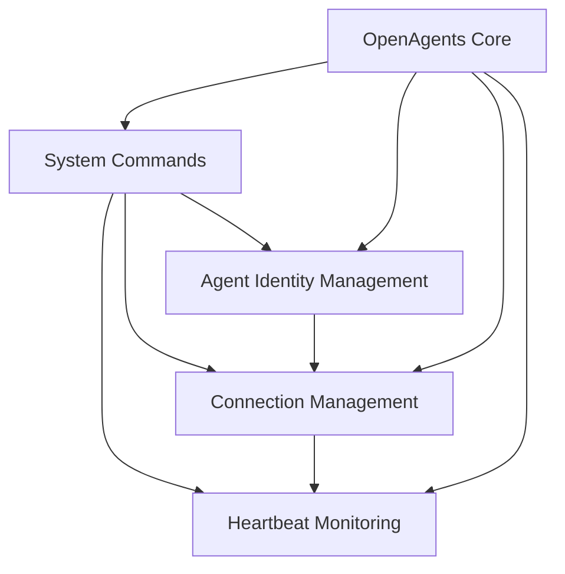

# OpenAgents Features Documentation

This directory contains comprehensive documentation for all features available in OpenAgents. Each feature is documented with implementation details, usage examples, and best practices.

## 🔄 Network Management Features

### [Heartbeat Monitoring](heartbeat-monitoring.md)
**Status:** ✅ Available | **Version:** 1.0.0

Automatic health checking and cleanup of agent connections. Solves the critical problem of stale connections preventing agent reconnection.

**Key Features:**
- Periodic ping/pong health checks
- Automatic stale connection cleanup  
- Configurable timeout settings
- Graceful recovery mechanisms

**Use Cases:**
- Production networks requiring high reliability
- Development environments with frequent agent restarts
- Long-running network deployments
- Networks with unstable connectivity

---

### [Connection Management](connection-management.md)
**Status:** ✅ Available | **Version:** 1.0.0

Comprehensive handling of agent connections including cleanup, conflict resolution, and reconnection mechanisms.

**Key Features:**
- Automatic resource cleanup
- Connection state consistency
- Conflict resolution
- Resource management and limits

**Use Cases:**
- High-scale networks with many agents
- Resource-constrained environments
- Networks requiring connection monitoring
- Systems needing graceful shutdowns

---

## 🔐 Security & Identity Features

### [Agent Identity Management](agent-identity-management.md)
**Status:** ✅ Available | **Version:** 1.0.0

Certificate-based identity verification and agent ID claiming system with cryptographic security.

**Key Features:**
- Certificate-based identity verification
- Secure agent ID claiming
- Cryptographic ownership proof
- Conflict resolution with authentication

**Use Cases:**
- Production networks requiring security
- Multi-tenant environments
- Systems with agent ID conflicts
- Networks needing persistent identity

---

## 🔧 Core Infrastructure Features

### [System Commands](system-commands.md)
**Status:** ✅ Available | **Version:** 1.0.0

Standardized mod for agent-network communication enabling system-level operations.

**Key Features:**
- Standardized command mod
- Agent registration and discovery
- Health monitoring commands
- Mod discovery and manifests

**Use Cases:**
- All OpenAgents deployments
- Custom mod development
- Network monitoring and management
- Agent discovery and coordination

---

## Feature Matrix

| Feature | Status | Security | Performance | Complexity | Use Case |
|---------|--------|----------|-------------|------------|----------|
| [Heartbeat Monitoring](heartbeat-monitoring.md) | ✅ | Low | High | Low | Production reliability |
| [Connection Management](connection-management.md) | ✅ | Medium | High | Medium | Resource management |
| [Agent Identity Management](agent-identity-management.md) | ✅ | High | Medium | High | Secure environments |
| [System Commands](system-commands.md) | ✅ | Medium | High | Low | Core infrastructure |

## Quick Start Guide

### 1. Basic Network Setup

```python
from openagents.core.network import create_network
from openagents.models.network_config import NetworkConfig

# Create network with all features enabled
config = NetworkConfig(
    name="Production Network",
    host="localhost",
    port=8080,
    # Heartbeat monitoring
    heartbeat_interval=30,
    agent_timeout=90,
    # Connection management
    max_connections=1000,
    cleanup_interval=60
)

network = create_network(config)
await network.initialize()
```

### 2. Secure Agent Connection

```python
from openagents.core.client import AgentClient

# Create secure agent with identity management
client = AgentClient(agent_id="secure-agent-001")

# Connect with certificate-based identity
success = await client.connect_to_server(
    host="localhost",
    port=8080,
    metadata={
        "name": "Secure Production Agent",
        "capabilities": ["messaging", "file_transfer"]
    }
)
```

### 3. Network Monitoring

```python
# Monitor network health
health_stats = await network.get_health_statistics()
print(f"Connected agents: {health_stats['connected_agents']}")
print(f"Network uptime: {health_stats['uptime']}")

# List connected agents
await client.connector.list_agents()

# Check available mods
await client.connector.list_mods()
```

## Feature Dependencies



## Configuration Examples

### Development Environment
```python
# Fast detection, low security
config = NetworkConfig(
    heartbeat_interval=10,
    agent_timeout=20,
    max_connections=50
)
```

### Production Environment
```python
# Balanced performance and reliability
config = NetworkConfig(
    heartbeat_interval=30,
    agent_timeout=90,
    max_connections=1000,
    # Enable all security features
    require_certificates=True,
    certificate_ttl_hours=24
)
```

### High-Security Environment
```python
# Maximum security, certificate required
config = NetworkConfig(
    heartbeat_interval=15,
    agent_timeout=45,
    max_connections=500,
    require_certificates=True,
    certificate_ttl_hours=8,
    force_certificate_validation=True
)
```

## Migration Guides

### From Legacy OpenAgents

**Step 1: Enable Heartbeat Monitoring**
```python
# Add to existing network config
config.heartbeat_interval = 30
config.agent_timeout = 90
```

**Step 2: Implement Identity Management**
```python
# Gradually migrate agents to use certificates
# Existing agents continue working without certificates
```

**Step 3: Enable Connection Limits**
```python
# Add resource management
config.max_connections = 1000
config.cleanup_interval = 60
```

### Backward Compatibility

All features are designed to be backward compatible:
- ✅ Legacy agents work with new servers
- ✅ New agents work with legacy servers (limited features)
- ✅ Gradual migration supported
- ✅ No breaking changes to existing APIs

## Performance Benchmarks

### Heartbeat Monitoring
- **Overhead:** ~100 bytes per agent per interval
- **CPU Usage:** <1% for 1000 agents
- **Memory:** ~1KB per agent connection

### Connection Management  
- **Cleanup Time:** <100ms per agent
- **Memory Recovery:** 100% after cleanup
- **Concurrent Connections:** 1000+ supported

### Identity Management
- **Certificate Generation:** <10ms per certificate
- **Validation Time:** <1ms per validation
- **Storage:** ~500 bytes per certificate

### System Commands
- **Request Latency:** <10ms typical
- **Throughput:** 1000+ commands/second
- **Memory:** <1KB per command

## Troubleshooting

### Common Issues

**Agents Not Connecting**
1. Check network configuration
2. Verify agent ID conflicts
3. Review certificate validation
4. Check connection limits

**High Resource Usage**
1. Adjust heartbeat intervals
2. Review connection limits
3. Check for memory leaks
4. Monitor cleanup efficiency

**Certificate Problems**
1. Verify secret key consistency
2. Check certificate expiration
3. Validate certificate format
4. Review identity manager logs

### Debug Tools

**Network Health Check**
```python
health = await network.check_health()
print(f"Status: {health['overall_status']}")
```

**Connection Monitoring**
```python
stats = await network.get_connection_stats()
print(f"Active: {stats['active_connections']}")
```

**Identity Audit**
```python
audit = network.identity_manager.get_audit_log()
print(f"Recent claims: {len(audit)}")
```

## Support and Community

### Getting Help
- 📖 **Documentation**: Complete feature docs in this directory
- 🐛 **Bug Reports**: Use GitHub issues with feature tags
- 💬 **Discussions**: Community support in GitHub discussions
- 🔧 **Examples**: Working examples in `/examples` directory

### Contributing
- 🛠️ **Feature Requests**: Propose new features via issues
- 📝 **Documentation**: Improve docs with pull requests
- 🧪 **Testing**: Add test cases for edge cases
- 🔍 **Code Review**: Review PRs for quality and security

### Roadmap

**v1.1 - Enhanced Security**
- Multi-factor authentication
- Advanced audit logging
- Certificate revocation
- Hardware security module support

**v1.2 - Scalability**  
- Distributed identity management
- Load balancing improvements
- Performance optimizations
- Cluster coordination

**v1.3 - Enterprise Features**
- LDAP/Active Directory integration
- Role-based access control
- Advanced monitoring dashboards
- Enterprise key management

## License and Compliance

All features are released under the same license as OpenAgents core. Security features follow industry best practices and are suitable for production use.

**Security Compliance:**
- 🔒 HMAC-SHA256 signatures
- 🔐 AES encryption support
- 📜 Certificate-based authentication
- 🛡️ Secure secret management

**Audit Trail:**
- 📊 All operations logged
- 🕰️ Timestamp-based tracking
- 🔍 Searchable event history
- 📈 Metrics and analytics