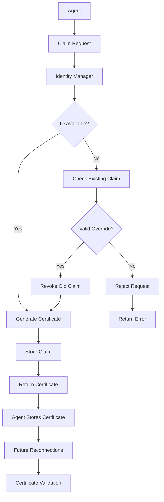

# Agent Identity Management

**Status:** ✅ Available  
**Version:** 1.0.0  
**Category:** Security & Identity

## Overview

The Agent Identity Management feature provides certificate-based identity verification and agent ID claiming in OpenAgents networks. It ensures that agent IDs can be securely claimed, validated, and reclaimed by their legitimate owners, preventing unauthorized use and enabling secure reconnection.

## Problem Statement

Traditional agent registration systems face several security and reliability challenges:

- **No Identity Verification**: Anyone can claim any agent ID
- **Permanent ID Squatting**: Once claimed, IDs cannot be reclaimed by legitimate owners
- **Reconnection Failures**: Agents cannot reconnect after crashes or network issues
- **Security Vulnerabilities**: No cryptographic proof of agent ownership
- **Conflict Resolution**: No mechanism to resolve ID conflicts fairly

## Solution

The Agent Identity Management system provides:

1. **Certificate-Based Identity**: Cryptographically signed certificates for agent ownership
2. **Secure ID Claiming**: First-come-first-served with certificate generation
3. **Validated Reconnection**: Certificate-based authentication for reconnection
4. **Conflict Resolution**: Legitimate owners can reclaim their IDs with valid certificates
5. **Expiration Management**: Time-based certificate expiration prevents indefinite claims

## How It Works

### Architecture



### Certificate Generation Process

1. **Claim Request**: Agent requests to claim a specific ID
2. **Availability Check**: System verifies ID is not already claimed
3. **Certificate Creation**: Generate cryptographically signed certificate
4. **Secure Storage**: Store claim in identity manager
5. **Certificate Delivery**: Return certificate to agent for future use

### Validation Process

1. **Connection Attempt**: Agent presents certificate during registration
2. **Certificate Verification**: Validate signature and expiration
3. **Ownership Check**: Confirm certificate matches claimed agent ID
4. **Override Decision**: Allow connection if certificate is valid
5. **Cleanup**: Remove conflicting connection if override approved

## Certificate Structure

### Certificate Fields

```json
{
    "agent_id": "my-secure-agent",
    "issued_at": 1640995200.0,
    "expires_at": 1641081600.0,
    "certificate_hash": "a1b2c3d4e5f6...",
    "signature": "f6e5d4c3b2a1..."
}
```

| Field | Type | Description |
|-------|------|-------------|
| `agent_id` | string | The agent ID this certificate authorizes |
| `issued_at` | float | Unix timestamp when certificate was issued |
| `expires_at` | float | Unix timestamp when certificate expires |
| `certificate_hash` | string | SHA256 hash of certificate data |
| `signature` | string | HMAC-SHA256 signature for authenticity |

### Cryptographic Security

**Signature Generation:**
```python
# Certificate data preparation
cert_data = {
    "agent_id": "my-agent",
    "issued_at": 1640995200.0,
    "expires_at": 1641081600.0
}

# JSON serialization with sorted keys
data_string = json.dumps(cert_data, sort_keys=True)

# Hash generation
cert_hash = hashlib.sha256(data_string.encode()).hexdigest()

# HMAC signature
signature = hmac.new(
    secret_key.encode(),
    data_string.encode(), 
    hashlib.sha256
).hexdigest()
```

## Configuration

### Identity Manager Setup

```python
from openagents.core.agent_identity import AgentIdentityManager

# Default configuration (24-hour certificates)
identity_manager = AgentIdentityManager()

# Custom configuration
identity_manager = AgentIdentityManager(
    secret_key="your-secure-secret-key-here",
    certificate_ttl_hours=48  # 48-hour certificates
)
```

### Network Integration

```python
from openagents.core.network import create_network
from openagents.models.network_config import NetworkConfig

# Network automatically includes identity management
config = NetworkConfig(
    name="Secure Network",
    host="localhost", 
    port=8080
)

network = create_network(config)
# network.identity_manager is automatically available
```

### Security Parameters

| Parameter | Type | Default | Description |
|-----------|------|---------|-------------|
| `secret_key` | string | auto-generated | HMAC signing key (keep secure!) |
| `certificate_ttl_hours` | int | 24 | Hours before certificate expires |
| `max_claims_per_hour` | int | 100 | Rate limiting for claim requests |

## API Reference

### System Commands

#### `claim_agent_id`

Claim an agent ID and receive a certificate.

**Request:**
```json
{
    "type": "system_request",
    "command": "claim_agent_id",
    "agent_id": "my-agent",
    "force": false
}
```

**Response (Success):**
```json
{
    "type": "system_response",
    "command": "claim_agent_id", 
    "success": true,
    "agent_id": "my-agent",
    "certificate": {
        "agent_id": "my-agent",
        "issued_at": 1640995200.0,
        "expires_at": 1641081600.0,
        "certificate_hash": "a1b2c3...",
        "signature": "f6e5d4..."
    }
}
```

**Response (Failure):**
```json
{
    "type": "system_response",
    "command": "claim_agent_id",
    "success": false,
    "error": "Agent ID my-agent is already claimed"
}
```

#### `validate_certificate`

Validate an agent certificate.

**Request:**
```json
{
    "type": "system_request", 
    "command": "validate_certificate",
    "certificate": {
        "agent_id": "my-agent",
        "issued_at": 1640995200.0,
        "expires_at": 1641081600.0,
        "certificate_hash": "a1b2c3...",
        "signature": "f6e5d4..."
    }
}
```

**Response:**
```json
{
    "type": "system_response",
    "command": "validate_certificate",
    "success": true,
    "valid": true,
    "agent_id": "my-agent"
}
```

#### Enhanced `register_agent`

Registration now supports certificate-based override.

**Request:**
```json
{
    "type": "system_request",
    "command": "register_agent", 
    "agent_id": "my-agent",
    "metadata": {
        "name": "My Secure Agent",
        "capabilities": ["messaging", "file_transfer"]
    },
    "certificate": {
        "agent_id": "my-agent",
        "issued_at": 1640995200.0,
        "expires_at": 1641081600.0,
        "certificate_hash": "a1b2c3...", 
        "signature": "f6e5d4..."
    },
    "force_reconnect": false
}
```

## Implementation Guide

### Basic Agent ID Claiming

```python
import asyncio
from openagents.core.client import AgentClient

class SecureAgent:
    def __init__(self, agent_id: str):
        self.agent_id = agent_id
        self.client = AgentClient(agent_id=agent_id)
        self.certificate = None
    
    async def claim_identity(self):
        """Claim agent ID and receive certificate"""
        
        # Connect to network
        await self.client.connect_to_server("localhost", 8080)
        
        # Set up response handler
        async def handle_claim_response(data):
            if data.get("success") and "certificate" in data:
                self.certificate = data["certificate"]
                print(f"✅ Claimed ID: {self.agent_id}")
                await self._save_certificate()
            else:
                print(f"❌ Claim failed: {data.get('error')}")
        
        self.client.connector.register_system_handler(
            "claim_agent_id", handle_claim_response
        )
        
        # Send claim request
        await self.client.connector.claim_agent_id(self.agent_id)
        await asyncio.sleep(2)  # Wait for response
        
        await self.client.disconnect()
        return self.certificate is not None
    
    async def _save_certificate(self):
        """Save certificate to file"""
        import json
        with open(f"{self.agent_id}_cert.json", "w") as f:
            json.dump(self.certificate, f, indent=2)
```

### Certificate-Based Reconnection

```python
class SecureAgent:
    async def load_certificate(self):
        """Load certificate from file"""
        try:
            import json
            with open(f"{self.agent_id}_cert.json", "r") as f:
                self.certificate = json.load(f)
            return True
        except FileNotFoundError:
            return False
    
    async def connect_with_certificate(self):
        """Connect using stored certificate"""
        
        if not self.certificate:
            if not await self.load_certificate():
                print("No certificate found, claiming identity...")
                return await self.claim_identity()
        
        # Connect with certificate in metadata
        metadata = {
            "name": f"Secure Agent {self.agent_id}",
            "certificate": self.certificate
        }
        
        success = await self.client.connect_to_server(
            "localhost", 8080, metadata=metadata
        )
        
        if success:
            print(f"✅ Connected with certificate")
            return True
        else:
            print(f"❌ Certificate validation failed")
            return False
```

### Force Override Example

```python
async def force_reclaim_id(self):
    """Force reconnection with certificate override"""
    
    if not self.certificate:
        print("No certificate available for override")
        return False
    
    # Attempt force reconnection
    metadata = {
        "certificate": self.certificate,
        "force_reconnect": True
    }
    
    success = await self.client.connect_to_server(
        "localhost", 8080, metadata=metadata  
    )
    
    if success:
        print(f"✅ Successfully reclaimed ID: {self.agent_id}")
        return True
    else:
        print(f"❌ Force override failed")
        return False
```

## Usage Examples

### Complete Secure Agent Implementation

```python
import asyncio
import json
import logging
from pathlib import Path
from openagents.core.client import AgentClient

class SecureAgent:
    def __init__(self, agent_id: str, cert_dir: str = "certificates"):
        self.agent_id = agent_id
        self.client = AgentClient(agent_id=agent_id)
        self.certificate = None
        self.cert_file = Path(cert_dir) / f"{agent_id}_cert.json"
        Path(cert_dir).mkdir(exist_ok=True)
    
    async def initialize(self, host: str = "localhost", port: int = 8080):
        """Initialize secure agent with identity management"""
        
        # Try to load existing certificate
        if self._load_certificate():
            print(f"📜 Loaded existing certificate for {self.agent_id}")
            
            # Attempt connection with certificate
            if await self._connect_with_certificate(host, port):
                return True
            else:
                print("Certificate validation failed, claiming new identity...")
        
        # Claim new identity if no valid certificate
        return await self._claim_new_identity(host, port)
    
    def _load_certificate(self) -> bool:
        """Load certificate from file"""
        try:
            if self.cert_file.exists():
                with open(self.cert_file, 'r') as f:
                    self.certificate = json.load(f)
                
                # Check if certificate is expired
                import time
                if time.time() > self.certificate.get('expires_at', 0):
                    print(f"⏰ Certificate expired, need to reclaim")
                    return False
                
                return True
        except Exception as e:
            print(f"Error loading certificate: {e}")
        return False
    
    def _save_certificate(self, certificate: dict):
        """Save certificate to file"""
        try:
            with open(self.cert_file, 'w') as f:
                json.dump(certificate, f, indent=2)
            self.certificate = certificate
            print(f"💾 Certificate saved to {self.cert_file}")
        except Exception as e:
            print(f"Error saving certificate: {e}")
    
    async def _claim_new_identity(self, host: str, port: int) -> bool:
        """Claim new agent identity"""
        
        # Connect to network
        if not await self.client.connect_to_server(host, port):
            print("Failed to connect for identity claiming")
            return False
        
        try:
            # Set up response handler
            claim_result = {"success": False, "certificate": None}
            
            async def handle_claim_response(data):
                claim_result["success"] = data.get("success", False)
                if data.get("success") and "certificate" in data:
                    claim_result["certificate"] = data["certificate"]
            
            self.client.connector.register_system_handler(
                "claim_agent_id", handle_claim_response
            )
            
            # Send claim request
            await self.client.connector.claim_agent_id(self.agent_id)
            
            # Wait for response
            await asyncio.sleep(3)
            
            if claim_result["success"] and claim_result["certificate"]:
                self._save_certificate(claim_result["certificate"])
                print(f"✅ Successfully claimed identity: {self.agent_id}")
                return True
            else:
                print(f"❌ Failed to claim identity: {self.agent_id}")
                return False
                
        finally:
            await self.client.disconnect()
    
    async def _connect_with_certificate(self, host: str, port: int) -> bool:
        """Connect using certificate"""
        
        metadata = {
            "name": f"Secure Agent {self.agent_id}",
            "type": "secure_agent",
            "certificate": self.certificate
        }
        
        return await self.client.connect_to_server(host, port, metadata=metadata)
    
    async def force_reclaim(self, host: str = "localhost", port: int = 8080) -> bool:
        """Force reclaim agent ID using certificate"""
        
        if not self.certificate:
            print("No certificate available for force reclaim")
            return False
        
        metadata = {
            "name": f"Secure Agent {self.agent_id}",
            "certificate": self.certificate,
            "force_reconnect": True
        }
        
        success = await self.client.connect_to_server(host, port, metadata=metadata)
        
        if success:
            print(f"✅ Force reclaim successful: {self.agent_id}")
        else:
            print(f"❌ Force reclaim failed: {self.agent_id}")
        
        return success
    
    async def disconnect(self):
        """Disconnect from network"""
        await self.client.disconnect()
        print(f"🔌 {self.agent_id} disconnected")

# Usage example
async def main():
    agent = SecureAgent("my-secure-agent")
    
    try:
        # Initialize with identity management
        if await agent.initialize():
            print("Agent connected and authenticated")
            
            # Do agent work here
            await asyncio.sleep(10)
            
        else:
            print("Failed to initialize secure agent")
    
    finally:
        await agent.disconnect()

if __name__ == "__main__":
    asyncio.run(main())
```

### Multi-Agent Conflict Resolution

```python
async def demonstrate_conflict_resolution():
    """Show how certificate system resolves ID conflicts"""
    
    print("🔄 Demonstrating conflict resolution...")
    
    # Start network
    from openagents.core.network import create_network
    from openagents.models.network_config import NetworkConfig
    
    config = NetworkConfig(
        name="Conflict Demo Network",
        host="localhost",
        port=8081
    )
    
    network = create_network(config)
    await network.initialize()
    
    try:
        # Agent 1 claims ID
        agent1 = SecureAgent("contested-agent-id")
        if await agent1.initialize("localhost", 8081):
            print("✅ Agent 1 claimed ID successfully")
            await agent1.disconnect()
            
            # Agent 2 tries to claim same ID (should fail)
            agent2 = SecureAgent("contested-agent-id")
            if not await agent2._claim_new_identity("localhost", 8081):
                print("✅ Agent 2 correctly rejected (ID already claimed)")
            
            # Agent 1 reconnects with certificate (should succeed)
            if await agent1._connect_with_certificate("localhost", 8081):
                print("✅ Agent 1 reconnected with certificate")
                
                # Agent 2 tries force override without certificate (should fail)
                if not await agent2.force_reclaim("localhost", 8081):
                    print("✅ Agent 2 force reclaim correctly rejected")
                
                await agent1.disconnect()
            
    finally:
        await network.shutdown()
        print("🔄 Conflict resolution demo complete")
```

## Security Considerations

### Certificate Security

**Storage Security:**
```python
import os
from cryptography.fernet import Fernet

class EncryptedCertificateStorage:
    def __init__(self, password: str):
        # Generate key from password
        from cryptography.hazmat.primitives import hashes
        from cryptography.hazmat.primitives.kdf.pbkdf2 import PBKDF2HMAC
        import base64
        
        kdf = PBKDF2HMAC(
            algorithm=hashes.SHA256(),
            length=32,
            salt=b'openagents_salt',  # Use unique salt in production
            iterations=100000,
        )
        key = base64.urlsafe_b64encode(kdf.derive(password.encode()))
        self.cipher = Fernet(key)
    
    def save_certificate(self, agent_id: str, certificate: dict):
        """Save encrypted certificate"""
        import json
        cert_data = json.dumps(certificate).encode()
        encrypted_data = self.cipher.encrypt(cert_data)
        
        with open(f"{agent_id}_cert.enc", "wb") as f:
            f.write(encrypted_data)
    
    def load_certificate(self, agent_id: str) -> dict:
        """Load and decrypt certificate"""
        try:
            with open(f"{agent_id}_cert.enc", "rb") as f:
                encrypted_data = f.read()
            
            decrypted_data = self.cipher.decrypt(encrypted_data)
            return json.loads(decrypted_data.decode())
        except Exception:
            return None
```

### Network Security

**TLS Configuration:**
```python
# Use TLS for production deployments
config = NetworkConfig(
    name="Secure Network",
    host="your-domain.com",
    port=443,
    tls_enabled=True,
    tls_cert_file="/path/to/cert.pem",
    tls_key_file="/path/to/key.pem"
)
```

**Secret Key Management:**
```python
import os
from openagents.core.agent_identity import AgentIdentityManager

# Load secret from environment or secure storage
secret_key = os.environ.get('OPENAGENTS_SECRET_KEY')
if not secret_key:
    raise ValueError("OPENAGENTS_SECRET_KEY environment variable required")

identity_manager = AgentIdentityManager(secret_key=secret_key)
```

### Best Practices

1. **Secret Key Security**:
   - Use strong, randomly generated secret keys
   - Store secret keys securely (environment variables, key vaults)
   - Rotate secret keys periodically
   - Never commit secret keys to version control

2. **Certificate Storage**:
   - Encrypt certificates at rest
   - Use secure file permissions (600)
   - Consider using system keychains/keystores
   - Implement certificate backup strategies

3. **Network Security**:
   - Always use TLS in production
   - Implement rate limiting for claim requests
   - Monitor for suspicious claiming patterns
   - Set up alerting for security events

4. **Certificate Lifecycle**:
   - Set appropriate expiration times
   - Implement certificate renewal processes
   - Monitor certificate expiration
   - Handle expired certificates gracefully

## Monitoring and Analytics

### Identity Manager Statistics

```python
async def get_identity_stats(network):
    """Get identity management statistics"""
    identity_manager = network.identity_manager
    
    stats = identity_manager.get_stats()
    print(f"📊 Identity Manager Statistics:")
    print(f"  • Claimed agents: {stats['claimed_agents']}")
    print(f"  • Active certificates: {stats['active_certificates']}")
    print(f"  • Certificate TTL: {stats['certificate_ttl_hours']} hours")
    
    return stats
```

### Certificate Audit Trail

```python
class AuditableIdentityManager(AgentIdentityManager):
    def __init__(self, *args, **kwargs):
        super().__init__(*args, **kwargs)
        self.audit_log = []
    
    def claim_agent_id(self, agent_id: str, force: bool = False):
        """Claim with audit logging"""
        import time
        
        result = super().claim_agent_id(agent_id, force)
        
        self.audit_log.append({
            "timestamp": time.time(),
            "action": "claim_attempt",
            "agent_id": agent_id,
            "force": force,
            "success": result is not None
        })
        
        return result
    
    def validate_certificate(self, certificate_data: dict) -> bool:
        """Validate with audit logging"""
        result = super().validate_certificate(certificate_data)
        
        self.audit_log.append({
            "timestamp": time.time(),
            "action": "certificate_validation",
            "agent_id": certificate_data.get("agent_id"),
            "valid": result
        })
        
        return result
    
    def get_audit_log(self):
        """Get audit trail"""
        return self.audit_log.copy()
```

## Migration and Deployment

### Gradual Migration

```python
async def migrate_to_identity_management(network):
    """Migrate existing agents to identity management"""
    
    print("🔄 Starting identity management migration...")
    
    # Get list of currently connected agents
    existing_agents = list(network.connections.keys())
    
    for agent_id in existing_agents:
        # Generate certificate for existing agent
        certificate = network.identity_manager.claim_agent_id(agent_id, force=True)
        
        if certificate:
            print(f"✅ Migrated agent {agent_id} to identity management")
            
            # Optionally notify agent of new certificate
            # await notify_agent_of_certificate(agent_id, certificate)
        else:
            print(f"❌ Failed to migrate agent {agent_id}")
    
    print("🔄 Migration complete")
```

### Deployment Checklist

**Pre-Deployment:**
- [ ] Generate and securely store secret key
- [ ] Configure certificate TTL appropriately
- [ ] Set up TLS certificates for production
- [ ] Implement certificate storage strategy
- [ ] Plan migration strategy for existing agents

**Deployment:**
- [ ] Deploy identity-enabled network servers
- [ ] Monitor initial certificate claiming activity
- [ ] Verify certificate validation is working
- [ ] Test conflict resolution scenarios

**Post-Deployment:**
- [ ] Monitor identity manager statistics
- [ ] Set up alerting for security events
- [ ] Document certificate recovery procedures
- [ ] Train operations team on identity management

## Troubleshooting

### Common Issues

**Certificate Validation Failures**
```
Symptoms: Agents cannot reconnect with certificates
Causes: 
  - Certificate expired
  - Wrong secret key
  - Certificate corruption
  - Clock skew

Solutions:
  - Check certificate expiration
  - Verify secret key consistency
  - Reclaim identity if needed
  - Synchronize system clocks
```

**ID Claiming Failures**
```
Symptoms: Cannot claim desired agent ID
Causes:
  - ID already claimed by another agent
  - Rate limiting active
  - Network connectivity issues

Solutions:
  - Use different agent ID
  - Wait for existing claim to expire
  - Check network connection
  - Use force override with valid certificate
```

**Certificate Storage Issues**
```
Symptoms: Certificates not persisting between sessions
Causes:
  - File permission issues
  - Disk space problems
  - Encryption/decryption errors

Solutions:
  - Check file permissions
  - Verify disk space
  - Test encryption setup
  - Implement backup storage
```

### Debug Tools

```python
async def debug_identity_system(network, agent_id: str):
    """Debug identity management for specific agent"""
    
    identity_manager = network.identity_manager
    
    print(f"🔍 Debugging identity for agent: {agent_id}")
    
    # Check if agent ID is claimed
    is_claimed = identity_manager.is_agent_claimed(agent_id)
    print(f"  • Agent ID claimed: {is_claimed}")
    
    # Get certificate if exists
    certificate = identity_manager.get_certificate(agent_id)
    if certificate:
        print(f"  • Certificate exists: Yes")
        print(f"  • Issued at: {certificate.issued_at}")
        print(f"  • Expires at: {certificate.expires_at}")
        print(f"  • Is expired: {certificate.is_expired()}")
    else:
        print(f"  • Certificate exists: No")
    
    # Check current connections
    is_connected = agent_id in network.connections
    print(f"  • Currently connected: {is_connected}")
    
    # Get general statistics
    stats = identity_manager.get_stats()
    print(f"  • Total claimed agents: {stats['claimed_agents']}")
    print(f"  • Active certificates: {stats['active_certificates']}")
```

## Future Roadmap

### Planned Enhancements

**v1.1: Enhanced Security**
- Multi-factor authentication support
- Hardware security module (HSM) integration
- Certificate revocation lists (CRL)
- Advanced audit logging

**v1.2: Scalability**
- Distributed identity management
- Certificate caching and replication
- Load balancing for identity operations
- Performance optimization

**v1.3: Enterprise Features**
- LDAP/Active Directory integration
- Role-based access control (RBAC)
- Certificate templates and policies
- Enterprise key management

**v2.0: Advanced Identity**
- Zero-knowledge proof authentication
- Blockchain-based identity verification
- Federated identity management
- Advanced threat detection