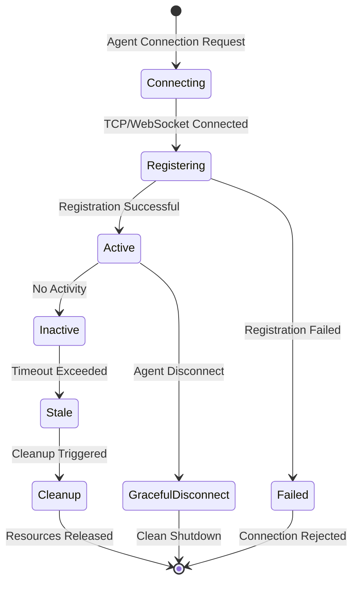

# Connection Management

**Status:** ✅ Available  
**Version:** 1.0.0  
**Category:** Network Infrastructure

## Overview

The Connection Management feature provides comprehensive handling of agent connections in OpenAgents networks, including automatic cleanup, conflict resolution, and robust reconnection mechanisms. It works in conjunction with heartbeat monitoring and identity management to ensure reliable network operations.

## Problem Statement

Traditional agent network systems face several connection management challenges:

- **Stale Connection Accumulation**: Dead connections remain in the system indefinitely
- **Resource Leaks**: Memory and network resources tied up by inactive connections
- **Reconnection Blocking**: Agents cannot reconnect after unexpected disconnections
- **Inconsistent State**: Network state becomes inconsistent with actual connectivity
- **Manual Intervention**: Requires administrator intervention to clean up connections

## Solution

The Connection Management system provides:

1. **Automatic Cleanup**: Removes stale connections automatically
2. **State Consistency**: Maintains accurate connection state across all network components
3. **Graceful Reconnection**: Enables seamless agent reconnection after cleanup
4. **Resource Management**: Efficiently manages memory and network resources
5. **Conflict Resolution**: Handles connection conflicts intelligently

## Architecture

### Connection Lifecycle



### Components

#### AgentConnection Class
Core data structure for tracking agent connections:

```python
class AgentConnection:
    def __init__(self, agent_id: str, connection: Any, metadata: Dict[str, Any], last_activity: float):
        self.agent_id = agent_id           # Unique agent identifier
        self.connection = connection       # WebSocket connection object
        self.metadata = metadata          # Agent metadata and capabilities
        self.last_activity = last_activity # Timestamp of last activity
```

#### Connection Registry
Central registry for all agent connections:

```python
# In AgentNetwork class
self.connections: Dict[str, AgentConnection] = {}  # agent_id -> connection
self.agents: Dict[str, Dict[str, Any]] = {}       # agent_id -> metadata
```

#### Cleanup Mechanisms
Multiple layers of connection cleanup:

1. **Heartbeat-Based**: Triggered by health check failures
2. **WebSocket-Based**: Triggered by connection close events
3. **Manual**: Administrative cleanup commands
4. **Time-Based**: Periodic cleanup of expired connections

## Connection States

### Active Connection
- **Definition**: Agent is connected and responsive
- **Characteristics**: Recent activity, responds to pings, can send/receive messages
- **Monitoring**: Last activity timestamp updated on message traffic
- **Lifecycle**: Normal operational state

### Inactive Connection
- **Definition**: Agent connected but no recent activity
- **Characteristics**: No recent messages, connection still open
- **Monitoring**: Activity timestamp older than threshold
- **Lifecycle**: Intermediate state before becoming stale

### Stale Connection
- **Definition**: Agent appears connected but is unresponsive
- **Characteristics**: Failed ping responses, old activity timestamp
- **Monitoring**: Identified by heartbeat monitoring
- **Lifecycle**: Marked for cleanup

### Cleaned Connection
- **Definition**: Connection removed from all registries
- **Characteristics**: All references removed, resources freed
- **Monitoring**: No longer tracked by network
- **Lifecycle**: Terminal state, allows reconnection

## Implementation Details

### Connection Registration

```python
async def handle_register_agent(command: str, data: Dict[str, Any], 
                               connection: ServerConnection, 
                               network_instance: Any) -> None:
    """Enhanced registration with conflict resolution"""
    agent_id = data.get("agent_id")
    metadata = data.get("metadata", {})
    certificate_data = data.get("certificate")
    force_reconnect = data.get("force_reconnect", False)
    
    # Check for existing connection
    if agent_id in network_instance.connections:
        # Determine if override is allowed
        can_override = False
        
        if certificate_data:
            # Certificate-based override
            if network_instance.identity_manager.validate_certificate(certificate_data):
                can_override = True
                logger.info(f"Certificate override approved for {agent_id}")
        elif force_reconnect:
            # Force override (less secure)
            can_override = True
            logger.info(f"Force override requested for {agent_id}")
        
        if can_override:
            # Clean up existing connection
            await network_instance.cleanup_agent(agent_id)
        else:
            # Reject registration
            await send_registration_error(connection, "Agent ID already in use")
            return
    
    # Create new connection
    agent_connection = AgentConnection(
        agent_id=agent_id,
        connection=connection,
        metadata=metadata,
        last_activity=time.time()
    )
    
    # Store in registries
    network_instance.connections[agent_id] = agent_connection
    await network_instance.register_agent(agent_id, metadata)
    
    # Send success response
    await send_registration_success(connection, network_instance)
```

### Connection Cleanup

```python
async def cleanup_agent(self, agent_id: str) -> bool:
    """Comprehensive agent cleanup"""
    try:
        cleanup_tasks = []
        
        # 1. Remove from connections registry
        if agent_id in self.connections:
            connection = self.connections[agent_id]
            
            # Close WebSocket connection gracefully
            try:
                await connection.connection.close()
            except Exception as e:
                logger.debug(f"Error closing connection for {agent_id}: {e}")
            
            del self.connections[agent_id]
            cleanup_tasks.append("connections_registry")
        
        # 2. Remove from agents registry
        if agent_id in self.agents:
            del self.agents[agent_id]
            cleanup_tasks.append("agents_registry")
        
        # 3. Unregister from topology
        try:
            await self.unregister_agent(agent_id)
            cleanup_tasks.append("topology_unregister")
        except Exception as e:
            logger.warning(f"Topology unregister failed for {agent_id}: {e}")
        
        # 4. Notify mod adapters
        try:
            await self._notify_agent_disconnection(agent_id)
            cleanup_tasks.append("mod_notification")
        except Exception as e:
            logger.warning(f"Mod notification failed for {agent_id}: {e}")
        
        # 5. Clean up mod-specific state
        try:
            await self._cleanup_mod_state(agent_id)
            cleanup_tasks.append("mod_cleanup")
        except Exception as e:
            logger.warning(f"Mod cleanup failed for {agent_id}: {e}")
        
        logger.info(f"Cleanup completed for {agent_id}: {cleanup_tasks}")
        return True
        
    except Exception as e:
        logger.error(f"Critical error during cleanup of {agent_id}: {e}")
        return False
```

### Activity Tracking

```python
def update_agent_activity(self, agent_id: str) -> None:
    """Update agent activity timestamp"""
    if agent_id in self.connections:
        self.connections[agent_id].last_activity = time.time()

async def _handle_agent_message(self, message: Message) -> None:
    """Handle incoming message and update activity"""
    sender_id = message.sender_id
    
    # Update activity for sender
    self.update_agent_activity(sender_id)
    
    # Process message
    await self._route_message(message)
```

## Configuration Options

### Network Configuration

```python
from openagents.models.network_config import NetworkConfig

config = NetworkConfig(
    # Connection management settings
    max_connections=1000,           # Maximum concurrent connections
    connection_timeout=300,         # Connection timeout in seconds
    cleanup_interval=60,            # Cleanup check interval
    
    # Activity tracking
    activity_timeout=180,           # Inactivity timeout
    activity_update_interval=30,    # How often to update activity
    
    # Resource limits
    max_memory_per_connection=10,   # MB per connection
    max_message_queue_size=100,     # Messages per agent queue
    
    # Heartbeat integration
    heartbeat_interval=30,          # Heartbeat check interval
    agent_timeout=90               # Agent timeout for cleanup
)
```

### Connection Limits

```python
class ConnectionLimiter:
    def __init__(self, max_connections: int = 1000):
        self.max_connections = max_connections
        self.connection_count = 0
    
    def can_accept_connection(self) -> bool:
        """Check if new connection can be accepted"""
        return self.connection_count < self.max_connections
    
    def add_connection(self) -> bool:
        """Add connection if under limit"""
        if self.can_accept_connection():
            self.connection_count += 1
            return True
        return False
    
    def remove_connection(self) -> None:
        """Remove connection from count"""
        if self.connection_count > 0:
            self.connection_count -= 1
```

## Usage Examples

### Basic Connection Monitoring

```python
import asyncio
from openagents.core.network import create_network
from openagents.models.network_config import NetworkConfig

async def monitor_connections():
    """Monitor network connections in real-time"""
    
    config = NetworkConfig(
        name="Monitored Network",
        host="localhost",
        port=8080,
        cleanup_interval=30
    )
    
    network = create_network(config)
    await network.initialize()
    
    try:
        while True:
            # Get connection statistics
            stats = {
                "total_connections": len(network.connections),
                "active_agents": len(network.agents),
                "uptime": time.time() - network.start_time
            }
            
            print(f"📊 Connection Stats: {stats}")
            
            # Show individual connection details
            for agent_id, connection in network.connections.items():
                inactive_time = time.time() - connection.last_activity
                status = "🟢 Active" if inactive_time < 60 else "🟡 Inactive"
                print(f"  {agent_id}: {status} (inactive: {inactive_time:.1f}s)")
            
            await asyncio.sleep(30)
    
    finally:
        await network.shutdown()
```

### Custom Cleanup Handlers

```python
class EnhancedConnectionManager:
    def __init__(self, network):
        self.network = network
        self.cleanup_handlers = []
    
    def register_cleanup_handler(self, handler):
        """Register custom cleanup handler"""
        self.cleanup_handlers.append(handler)
    
    async def enhanced_cleanup(self, agent_id: str) -> bool:
        """Enhanced cleanup with custom handlers"""
        
        # Run custom cleanup handlers first
        for handler in self.cleanup_handlers:
            try:
                await handler(agent_id)
            except Exception as e:
                logger.warning(f"Custom cleanup handler failed: {e}")
        
        # Run standard cleanup
        return await self.network.cleanup_agent(agent_id)

# Usage
async def custom_cleanup_handler(agent_id: str):
    """Custom cleanup logic"""
    print(f"🧹 Custom cleanup for {agent_id}")
    # Cleanup application-specific resources
    await cleanup_agent_files(agent_id)
    await notify_external_systems(agent_id)

manager = EnhancedConnectionManager(network)
manager.register_cleanup_handler(custom_cleanup_handler)
```

### Connection Health Dashboard

```python
class ConnectionHealthDashboard:
    def __init__(self, network):
        self.network = network
        self.metrics = {
            "connections_created": 0,
            "connections_cleaned": 0,
            "cleanup_failures": 0,
            "average_connection_duration": 0
        }
    
    async def start_monitoring(self):
        """Start health monitoring dashboard"""
        while self.network.is_running:
            await self._update_metrics()
            await self._display_dashboard()
            await asyncio.sleep(10)
    
    async def _update_metrics(self):
        """Update connection metrics"""
        current_time = time.time()
        
        # Calculate connection durations
        durations = []
        for connection in self.network.connections.values():
            duration = current_time - connection.last_activity
            durations.append(duration)
        
        if durations:
            self.metrics["average_connection_duration"] = sum(durations) / len(durations)
    
    async def _display_dashboard(self):
        """Display connection health dashboard"""
        print("\n" + "="*50)
        print("CONNECTION HEALTH DASHBOARD")
        print("="*50)
        
        print(f"📊 Total Connections: {len(self.network.connections)}")
        print(f"🆕 Connections Created: {self.metrics['connections_created']}")
        print(f"🧹 Connections Cleaned: {self.metrics['connections_cleaned']}")
        print(f"❌ Cleanup Failures: {self.metrics['cleanup_failures']}")
        print(f"⏱️  Avg Duration: {self.metrics['average_connection_duration']:.1f}s")
        
        # Connection status breakdown
        current_time = time.time()
        active_count = 0
        inactive_count = 0
        stale_count = 0
        
        for connection in self.network.connections.values():
            inactive_time = current_time - connection.last_activity
            if inactive_time < 30:
                active_count += 1
            elif inactive_time < 90:
                inactive_count += 1
            else:
                stale_count += 1
        
        print(f"🟢 Active: {active_count}")
        print(f"🟡 Inactive: {inactive_count}")  
        print(f"🔴 Stale: {stale_count}")
        print("="*50)
```

### Graceful Shutdown

```python
async def graceful_network_shutdown(network, timeout: int = 30):
    """Gracefully shutdown network with proper cleanup"""
    
    print("🔄 Starting graceful network shutdown...")
    
    # 1. Stop accepting new connections
    network.accepting_connections = False
    
    # 2. Notify all connected agents
    shutdown_message = {
        "type": "system_notification",
        "event": "network_shutdown",
        "message": "Network is shutting down, please disconnect gracefully",
        "timeout": timeout
    }
    
    disconnect_tasks = []
    for agent_id, connection in network.connections.items():
        task = asyncio.create_task(
            _notify_agent_shutdown(connection, shutdown_message)
        )
        disconnect_tasks.append(task)
    
    # 3. Wait for graceful disconnections
    try:
        await asyncio.wait_for(
            asyncio.gather(*disconnect_tasks, return_exceptions=True),
            timeout=timeout
        )
    except asyncio.TimeoutError:
        print(f"⚠️  Graceful shutdown timeout ({timeout}s), forcing cleanup")
    
    # 4. Cleanup remaining connections
    remaining_agents = list(network.connections.keys())
    for agent_id in remaining_agents:
        await network.cleanup_agent(agent_id)
    
    # 5. Shutdown network infrastructure
    await network.shutdown()
    
    print("✅ Network shutdown complete")

async def _notify_agent_shutdown(connection, message):
    """Notify individual agent of shutdown"""
    try:
        await connection.connection.send(json.dumps(message))
        # Wait for agent to disconnect gracefully
        await asyncio.sleep(2)
    except Exception as e:
        logger.debug(f"Error notifying agent of shutdown: {e}")
```

## Advanced Features

### Connection Pooling

```python
class ConnectionPool:
    def __init__(self, max_size: int = 100):
        self.max_size = max_size
        self.pool = asyncio.Queue(maxsize=max_size)
        self.active_connections = set()
    
    async def get_connection(self) -> AgentConnection:
        """Get connection from pool or create new one"""
        try:
            # Try to get from pool
            connection = self.pool.get_nowait()
            self.active_connections.add(connection)
            return connection
        except asyncio.QueueEmpty:
            # Create new connection if pool is empty
            return await self._create_new_connection()
    
    async def return_connection(self, connection: AgentConnection):
        """Return connection to pool"""
        if connection in self.active_connections:
            self.active_connections.remove(connection)
            
            # Only return to pool if it's still healthy
            if await self._is_connection_healthy(connection):
                try:
                    self.pool.put_nowait(connection)
                except asyncio.QueueFull:
                    # Pool is full, close the connection
                    await self._close_connection(connection)
    
    async def _is_connection_healthy(self, connection: AgentConnection) -> bool:
        """Check if connection is healthy for reuse"""
        try:
            # Simple health check
            return connection.connection.open and not connection.connection.closed
        except:
            return False
```

### Load Balancing

```python
class ConnectionLoadBalancer:
    def __init__(self, network_nodes: List[str]):
        self.network_nodes = network_nodes
        self.node_connections = {node: 0 for node in network_nodes}
        self.round_robin_index = 0
    
    def get_least_loaded_node(self) -> str:
        """Get node with least connections"""
        return min(self.node_connections, key=self.node_connections.get)
    
    def get_round_robin_node(self) -> str:
        """Get next node in round-robin order"""
        node = self.network_nodes[self.round_robin_index]
        self.round_robin_index = (self.round_robin_index + 1) % len(self.network_nodes)
        return node
    
    def allocate_connection(self, strategy: str = "least_loaded") -> str:
        """Allocate connection to a node"""
        if strategy == "least_loaded":
            node = self.get_least_loaded_node()
        elif strategy == "round_robin":
            node = self.get_round_robin_node()
        else:
            raise ValueError(f"Unknown strategy: {strategy}")
        
        self.node_connections[node] += 1
        return node
    
    def deallocate_connection(self, node: str):
        """Deallocate connection from a node"""
        if node in self.node_connections and self.node_connections[node] > 0:
            self.node_connections[node] -= 1
```

## Monitoring and Metrics

### Connection Metrics Collection

```python
class ConnectionMetrics:
    def __init__(self):
        self.metrics = {
            "total_connections": 0,
            "successful_connections": 0,
            "failed_connections": 0,
            "cleanup_operations": 0,
            "average_connection_duration": 0,
            "peak_concurrent_connections": 0,
            "connection_rate": 0  # connections per minute
        }
        self.connection_history = []
        self.cleanup_history = []
    
    def record_connection(self, agent_id: str, success: bool):
        """Record a connection attempt"""
        timestamp = time.time()
        
        self.metrics["total_connections"] += 1
        if success:
            self.metrics["successful_connections"] += 1
            self.connection_history.append({
                "agent_id": agent_id,
                "timestamp": timestamp,
                "event": "connected"
            })
        else:
            self.metrics["failed_connections"] += 1
    
    def record_cleanup(self, agent_id: str, reason: str):
        """Record a cleanup operation"""
        timestamp = time.time()
        
        self.metrics["cleanup_operations"] += 1
        self.cleanup_history.append({
            "agent_id": agent_id,
            "timestamp": timestamp,
            "reason": reason
        })
    
    def update_concurrent_connections(self, count: int):
        """Update concurrent connection count"""
        if count > self.metrics["peak_concurrent_connections"]:
            self.metrics["peak_concurrent_connections"] = count
    
    def calculate_connection_rate(self) -> float:
        """Calculate connections per minute"""
        current_time = time.time()
        one_minute_ago = current_time - 60
        
        recent_connections = [
            conn for conn in self.connection_history
            if conn["timestamp"] > one_minute_ago
        ]
        
        return len(recent_connections)
    
    def get_summary(self) -> Dict[str, Any]:
        """Get metrics summary"""
        return {
            **self.metrics,
            "connection_rate": self.calculate_connection_rate(),
            "success_rate": (
                self.metrics["successful_connections"] / 
                max(self.metrics["total_connections"], 1)
            ) * 100
        }
```

### Health Checks

```python
class ConnectionHealthChecker:
    def __init__(self, network):
        self.network = network
        self.health_thresholds = {
            "max_inactive_time": 300,     # 5 minutes
            "max_stale_connections": 10,   # Maximum stale connections
            "min_success_rate": 95.0,      # Minimum connection success rate
            "max_cleanup_rate": 5.0        # Maximum cleanups per minute
        }
    
    async def check_network_health(self) -> Dict[str, Any]:
        """Comprehensive network health check"""
        current_time = time.time()
        health_report = {
            "overall_status": "healthy",
            "checks": {},
            "recommendations": []
        }
        
        # Check 1: Stale connections
        stale_count = self._count_stale_connections()
        health_report["checks"]["stale_connections"] = {
            "status": "healthy" if stale_count <= self.health_thresholds["max_stale_connections"] else "warning",
            "value": stale_count,
            "threshold": self.health_thresholds["max_stale_connections"]
        }
        
        # Check 2: Connection success rate
        success_rate = self._calculate_success_rate()
        health_report["checks"]["success_rate"] = {
            "status": "healthy" if success_rate >= self.health_thresholds["min_success_rate"] else "critical",
            "value": success_rate,
            "threshold": self.health_thresholds["min_success_rate"]
        }
        
        # Check 3: Cleanup rate
        cleanup_rate = self._calculate_cleanup_rate()
        health_report["checks"]["cleanup_rate"] = {
            "status": "healthy" if cleanup_rate <= self.health_thresholds["max_cleanup_rate"] else "warning",
            "value": cleanup_rate,
            "threshold": self.health_thresholds["max_cleanup_rate"]
        }
        
        # Determine overall status
        if any(check["status"] == "critical" for check in health_report["checks"].values()):
            health_report["overall_status"] = "critical"
        elif any(check["status"] == "warning" for check in health_report["checks"].values()):
            health_report["overall_status"] = "warning"
        
        # Generate recommendations
        health_report["recommendations"] = self._generate_recommendations(health_report)
        
        return health_report
    
    def _count_stale_connections(self) -> int:
        """Count connections that appear stale"""
        current_time = time.time()
        stale_count = 0
        
        for connection in self.network.connections.values():
            inactive_time = current_time - connection.last_activity
            if inactive_time > self.health_thresholds["max_inactive_time"]:
                stale_count += 1
        
        return stale_count
    
    def _generate_recommendations(self, health_report: Dict[str, Any]) -> List[str]:
        """Generate health recommendations"""
        recommendations = []
        
        if health_report["checks"]["stale_connections"]["status"] != "healthy":
            recommendations.append("Consider reducing heartbeat interval to detect stale connections faster")
        
        if health_report["checks"]["success_rate"]["status"] != "healthy":
            recommendations.append("Investigate connection failures and network stability")
        
        if health_report["checks"]["cleanup_rate"]["status"] != "healthy":
            recommendations.append("High cleanup rate may indicate network instability or client issues")
        
        return recommendations
```

## Best Practices

### Resource Management

```python
class ResourceAwareConnectionManager:
    def __init__(self, network):
        self.network = network
        self.resource_limits = {
            "max_memory_mb": 1000,
            "max_connections": 1000,
            "max_message_queue_size": 100
        }
        self.resource_usage = {
            "memory_mb": 0,
            "connections": 0,
            "queued_messages": 0
        }
    
    async def can_accept_connection(self, agent_id: str) -> tuple[bool, str]:
        """Check if connection can be accepted based on resources"""
        
        # Check connection limit
        if self.resource_usage["connections"] >= self.resource_limits["max_connections"]:
            return False, "Maximum connections reached"
        
        # Check memory usage
        if self.resource_usage["memory_mb"] >= self.resource_limits["max_memory_mb"]:
            return False, "Memory limit reached"
        
        # Check message queue capacity
        if self.resource_usage["queued_messages"] >= self.resource_limits["max_message_queue_size"]:
            return False, "Message queue full"
        
        return True, "OK"
    
    async def allocate_connection_resources(self, agent_id: str):
        """Allocate resources for new connection"""
        estimated_memory = self._estimate_connection_memory(agent_id)
        
        self.resource_usage["connections"] += 1
        self.resource_usage["memory_mb"] += estimated_memory
    
    async def deallocate_connection_resources(self, agent_id: str):
        """Deallocate resources for removed connection"""
        estimated_memory = self._estimate_connection_memory(agent_id)
        
        self.resource_usage["connections"] = max(0, self.resource_usage["connections"] - 1)
        self.resource_usage["memory_mb"] = max(0, self.resource_usage["memory_mb"] - estimated_memory)
```

### Error Handling

```python
class RobustConnectionManager:
    def __init__(self, network):
        self.network = network
        self.retry_config = {
            "max_retries": 3,
            "retry_delay": 1.0,
            "backoff_multiplier": 2.0
        }
    
    async def safe_cleanup_agent(self, agent_id: str) -> bool:
        """Cleanup agent with retry logic and error handling"""
        
        for attempt in range(self.retry_config["max_retries"]):
            try:
                success = await self.network.cleanup_agent(agent_id)
                if success:
                    return True
                
            except Exception as e:
                logger.warning(f"Cleanup attempt {attempt + 1} failed for {agent_id}: {e}")
                
                if attempt < self.retry_config["max_retries"] - 1:
                    delay = self.retry_config["retry_delay"] * (
                        self.retry_config["backoff_multiplier"] ** attempt
                    )
                    await asyncio.sleep(delay)
        
        # If all retries failed, perform emergency cleanup
        logger.error(f"All cleanup attempts failed for {agent_id}, performing emergency cleanup")
        return await self._emergency_cleanup(agent_id)
    
    async def _emergency_cleanup(self, agent_id: str) -> bool:
        """Emergency cleanup that never fails"""
        try:
            # Force remove from all registries
            self.network.connections.pop(agent_id, None)
            self.network.agents.pop(agent_id, None)
            
            # Best effort topology cleanup
            try:
                await self.network.topology.unregister_agent(agent_id)
            except:
                pass  # Ignore topology errors in emergency mode
            
            logger.info(f"Emergency cleanup completed for {agent_id}")
            return True
            
        except Exception as e:
            logger.critical(f"Emergency cleanup failed for {agent_id}: {e}")
            return False
```

## Performance Optimization

### Batch Operations

```python
class BatchConnectionManager:
    def __init__(self, network):
        self.network = network
        self.batch_size = 50
        self.batch_timeout = 5.0
        self.pending_cleanups = []
        self.batch_task = None
    
    async def queue_cleanup(self, agent_id: str, reason: str = "batch_cleanup"):
        """Queue agent for batch cleanup"""
        self.pending_cleanups.append({
            "agent_id": agent_id,
            "reason": reason,
            "timestamp": time.time()
        })
        
        # Start batch processor if not running
        if self.batch_task is None or self.batch_task.done():
            self.batch_task = asyncio.create_task(self._process_batch_cleanups())
    
    async def _process_batch_cleanups(self):
        """Process cleanups in batches"""
        while self.pending_cleanups:
            # Wait for batch to fill or timeout
            start_time = time.time()
            while (len(self.pending_cleanups) < self.batch_size and 
                   time.time() - start_time < self.batch_timeout):
                await asyncio.sleep(0.1)
            
            # Process current batch
            batch = self.pending_cleanups[:self.batch_size]
            self.pending_cleanups = self.pending_cleanups[self.batch_size:]
            
            await self._execute_batch_cleanup(batch)
    
    async def _execute_batch_cleanup(self, batch: List[Dict[str, Any]]):
        """Execute batch cleanup operations"""
        cleanup_tasks = []
        
        for item in batch:
            task = asyncio.create_task(
                self.network.cleanup_agent(item["agent_id"])
            )
            cleanup_tasks.append(task)
        
        # Execute all cleanups concurrently
        results = await asyncio.gather(*cleanup_tasks, return_exceptions=True)
        
        # Log results
        for i, result in enumerate(results):
            agent_id = batch[i]["agent_id"]
            if isinstance(result, Exception):
                logger.error(f"Batch cleanup failed for {agent_id}: {result}")
            else:
                logger.debug(f"Batch cleanup successful for {agent_id}")
```

### Memory Optimization

```python
class MemoryOptimizedConnectionManager:
    def __init__(self, network):
        self.network = network
        self.weak_references = weakref.WeakValueDictionary()
        self.connection_cache = {}
        self.cache_ttl = 300  # 5 minutes
    
    def cache_connection_metadata(self, agent_id: str, metadata: Dict[str, Any]):
        """Cache connection metadata with TTL"""
        cache_entry = {
            "metadata": metadata,
            "timestamp": time.time(),
            "ttl": self.cache_ttl
        }
        self.connection_cache[agent_id] = cache_entry
    
    def get_cached_metadata(self, agent_id: str) -> Optional[Dict[str, Any]]:
        """Get cached metadata if not expired"""
        if agent_id in self.connection_cache:
            entry = self.connection_cache[agent_id]
            if time.time() - entry["timestamp"] < entry["ttl"]:
                return entry["metadata"]
            else:
                # Remove expired entry
                del self.connection_cache[agent_id]
        return None
    
    async def cleanup_memory(self):
        """Periodic memory cleanup"""
        current_time = time.time()
        
        # Clean expired cache entries
        expired_keys = [
            key for key, value in self.connection_cache.items()
            if current_time - value["timestamp"] > value["ttl"]
        ]
        
        for key in expired_keys:
            del self.connection_cache[key]
        
        # Force garbage collection if memory usage is high
        import gc
        import psutil
        
        memory_usage = psutil.Process().memory_info().rss / 1024 / 1024  # MB
        if memory_usage > 500:  # If using more than 500MB
            gc.collect()
            logger.info(f"Performed garbage collection, memory usage: {memory_usage:.1f}MB")
```

This comprehensive Connection Management documentation covers all aspects of handling agent connections in OpenAgents, from basic concepts to advanced optimization techniques. The feature provides a robust foundation for reliable network operations with automatic cleanup, conflict resolution, and resource management.