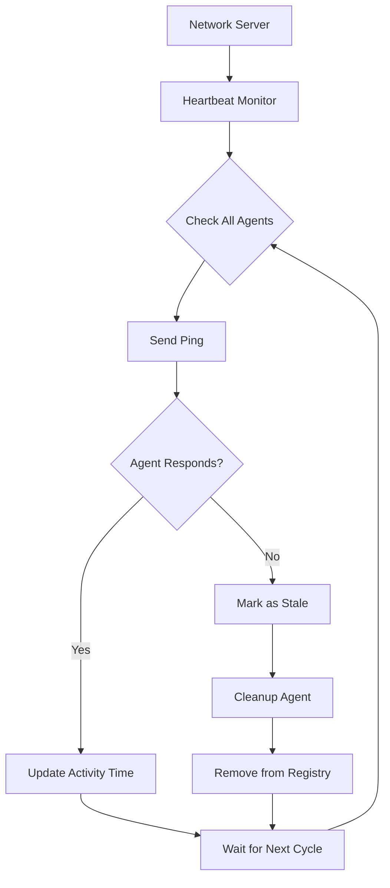

# Heartbeat Monitoring

**Status:** ✅ Available  
**Version:** 1.0.0  
**Category:** Network Management

## Overview

The Heartbeat Monitoring feature provides automatic health checking and cleanup of agent connections in OpenAgents networks. It solves the critical problem of stale connections that prevent agent reconnection after unexpected disconnections.

## Problem Statement

Before heartbeat monitoring, when agents disconnected unexpectedly (network issues, crashes, etc.), their connection entries remained in the network registry indefinitely. This caused:

- **Reconnection Failures**: Agents couldn't reconnect with the same ID
- **Resource Leaks**: Stale connections consumed memory and resources  
- **Network Pollution**: Dead agents appeared as "connected" in agent lists
- **Manual Intervention**: Required restarting the network server to cleanup

## Solution

The heartbeat monitoring system provides:

1. **Automatic Health Checks**: Periodic ping/pong verification
2. **Intelligent Cleanup**: Removes unresponsive agents automatically
3. **Configurable Timeouts**: Customizable intervals and thresholds
4. **Graceful Recovery**: Allows legitimate reconnections after cleanup

## How It Works

### Architecture



### Monitoring Process

1. **Background Task**: Runs continuously while network is active
2. **Agent Iteration**: Checks each connected agent periodically
3. **Activity Check**: Compares last activity time with timeout threshold
4. **Ping Test**: Sends ping request to potentially stale agents
5. **Response Evaluation**: Waits for pong response with timeout
6. **Cleanup Decision**: Removes agents that fail to respond
7. **Registry Update**: Cleans up all references and connections

### Ping/Pong Protocol

**Ping Request (Server → Agent):**
```json
{
    "type": "system_request",
    "command": "ping_agent",
    "timestamp": 1640995200.0
}
```

**Pong Response (Agent → Server):**
```json
{
    "type": "system_response", 
    "command": "ping_agent",
    "success": true,
    "timestamp": 1640995200.0
}
```

## Configuration

### Network Configuration

```python
from openagents.models.network_config import NetworkConfig

config = NetworkConfig(
    name="My Network",
    host="localhost",
    port=8080,
    # Heartbeat settings
    heartbeat_interval=30,  # Check every 30 seconds
    agent_timeout=90       # Cleanup after 90 seconds of inactivity
)
```

### Configuration Parameters

| Parameter | Type | Default | Description |
|-----------|------|---------|-------------|
| `heartbeat_interval` | int | 30 | Seconds between health checks |
| `agent_timeout` | int | 90 | Seconds before considering agent stale |
| `ping_timeout` | int | 5 | Seconds to wait for ping response |

### Recommended Settings

**Development Environment:**
```python
heartbeat_interval=10  # Fast detection for testing
agent_timeout=20      # Quick cleanup
```

**Production Environment:**
```python
heartbeat_interval=30  # Balanced performance
agent_timeout=90      # Stable for network variations
```

**High-Latency Networks:**
```python
heartbeat_interval=60  # Reduce network overhead
agent_timeout=180     # Account for slow connections
```

## Implementation Details

### Server-Side Components

#### HeartbeatMonitor Task
```python
async def _heartbeat_monitor(self) -> None:
    """Main monitoring loop"""
    while self.is_running:
        current_time = time.time()
        stale_agents = []
        
        # Check all connected agents
        for agent_id, connection in self.connections.items():
            if self._is_stale(connection, current_time):
                if not await self._ping_agent(agent_id, connection):
                    stale_agents.append(agent_id)
        
        # Cleanup stale agents
        for agent_id in stale_agents:
            await self.cleanup_agent(agent_id)
        
        await asyncio.sleep(self.heartbeat_interval)
```

#### Ping Implementation
```python
async def _ping_agent(self, agent_id: str, connection: AgentConnection) -> bool:
    """Send ping and wait for response"""
    try:
        ping_message = {
            "type": "system_request",
            "command": "ping_agent", 
            "timestamp": time.time()
        }
        
        await connection.connection.send(json.dumps(ping_message))
        
        response = await asyncio.wait_for(
            connection.connection.recv(),
            timeout=5.0
        )
        
        data = json.loads(response)
        return (data.get("type") == "system_response" and
                data.get("command") == "ping_agent" and
                data.get("success"))
                
    except Exception:
        return False
```

### Client-Side Components

#### Automatic Ping Response
```python
# In NetworkConnector._listen_for_messages()
elif data.get("type") == "system_request":
    command = data.get("command")
    if command == "ping_agent":
        pong_response = {
            "type": "system_response",
            "command": "ping_agent",
            "success": True,
            "timestamp": data.get("timestamp", time.time())
        }
        await self.connection.send(json.dumps(pong_response))
```

## Usage Examples

### Basic Usage

```python
import asyncio
from openagents.core.network import create_network
from openagents.models.network_config import NetworkConfig

async def start_monitored_network():
    # Create network with heartbeat monitoring
    config = NetworkConfig(
        name="Monitored Network",
        host="localhost",
        port=8080,
        heartbeat_interval=30,
        agent_timeout=90
    )
    
    network = create_network(config)
    
    # Start network (heartbeat monitoring starts automatically)
    if await network.initialize():
        print("✅ Network started with heartbeat monitoring")
        
        # Network will automatically monitor and cleanup stale agents
        await asyncio.sleep(3600)  # Run for 1 hour
        
        await network.shutdown()
```

### Monitoring Network Health

```python
async def monitor_network_health(network):
    """Monitor network health statistics"""
    while network.is_running:
        stats = {
            "connected_agents": len(network.connections),
            "active_since": network.start_time,
            "heartbeat_interval": network.heartbeat_interval,
            "agent_timeout": network.agent_timeout
        }
        
        print(f"Network Health: {stats}")
        await asyncio.sleep(60)  # Check every minute
```

### Custom Cleanup Handling

```python
async def handle_agent_cleanup(network):
    """Custom handler for agent cleanup events"""
    
    original_cleanup = network.cleanup_agent
    
    async def enhanced_cleanup(agent_id: str) -> bool:
        print(f"🧹 Cleaning up stale agent: {agent_id}")
        
        # Log cleanup event
        logger.info(f"Agent {agent_id} removed due to inactivity")
        
        # Perform custom cleanup logic
        await notify_other_services(agent_id)
        
        # Call original cleanup
        return await original_cleanup(agent_id)
    
    # Replace cleanup method
    network.cleanup_agent = enhanced_cleanup
```

## Monitoring and Debugging

### Logging

Enable detailed heartbeat logging:

```python
import logging

# Enable heartbeat debug logging
logging.getLogger('openagents.core.network').setLevel(logging.DEBUG)

# Example log output:
# DEBUG:openagents.core.network:Agent agent-123 responded to ping
# WARNING:openagents.core.network:Agent agent-456 failed ping check (inactive for 95.2s)
# INFO:openagents.core.network:Cleaning up stale agent agent-456
```

### Health Check Endpoint

```python
async def get_network_health(network):
    """Get detailed network health information"""
    current_time = time.time()
    
    health_info = {
        "total_agents": len(network.connections),
        "heartbeat_active": network.heartbeat_task is not None,
        "last_cleanup": getattr(network, '_last_cleanup_time', None),
        "agents": []
    }
    
    for agent_id, connection in network.connections.items():
        agent_health = {
            "agent_id": agent_id,
            "last_activity": connection.last_activity,
            "inactive_seconds": current_time - connection.last_activity,
            "status": "healthy" if (current_time - connection.last_activity) < network.agent_timeout else "stale"
        }
        health_info["agents"].append(agent_health)
    
    return health_info
```

## Performance Considerations

### Network Overhead

- **Ping Frequency**: Each ping is ~100 bytes
- **Network Traffic**: `agents × ping_size / heartbeat_interval`
- **Example**: 100 agents, 30s interval = ~330 bytes/second

### CPU Usage

- **Monitoring Task**: Minimal CPU usage for iteration and timing
- **Cleanup Operations**: Brief CPU spikes during agent removal
- **WebSocket I/O**: Handled asynchronously

### Memory Usage

- **Connection Tracking**: ~1KB per agent connection
- **Cleanup**: Memory freed immediately upon agent removal
- **Heartbeat Task**: ~10KB baseline memory usage

### Optimization Tips

1. **Tune Intervals**: Balance responsiveness vs. overhead
2. **Batch Operations**: Process multiple agents efficiently
3. **Connection Pooling**: Reuse connections when possible
4. **Async Processing**: All operations are non-blocking

## Troubleshooting

### Common Issues

**Agents Being Cleaned Up Too Quickly**
```
Problem: Healthy agents are being removed
Solution: Increase agent_timeout or decrease heartbeat_interval
```

**Stale Agents Not Being Cleaned**
```
Problem: Dead agents remain connected
Solution: Decrease agent_timeout or check ping response handling
```

**High Network Traffic**
```
Problem: Too many ping requests
Solution: Increase heartbeat_interval
```

**Ping Timeouts**
```
Problem: Agents not responding to pings
Solution: Check network latency, increase ping timeout
```

### Debug Commands

```python
# Check heartbeat status
print(f"Heartbeat active: {network.heartbeat_task is not None}")

# Manual ping test
success = await network._ping_agent("agent-123", connection)
print(f"Ping successful: {success}")

# Force cleanup
await network.cleanup_agent("agent-123")

# Check agent activity
for agent_id, conn in network.connections.items():
    inactive_time = time.time() - conn.last_activity
    print(f"Agent {agent_id}: {inactive_time:.1f}s inactive")
```

## Integration with Other Features

### Agent ID Claiming
- Heartbeat monitoring works seamlessly with certificate-based agents
- Claimed agents are cleaned up normally when unresponsive
- Certificates allow immediate reconnection after cleanup

### Protocol Systems
- Protocol adapters receive disconnect notifications
- Custom protocols can implement their own cleanup logic
- Heartbeat events can trigger protocol-specific actions

### Load Balancing
- Health information enables intelligent load distribution
- Dead agents are automatically removed from routing tables
- New connections get distributed to healthy nodes

## Migration Guide

### From Legacy Systems

**Existing Networks:**
```python
# Old configuration (no heartbeat)
config = NetworkConfig(name="Old Network", host="localhost", port=8080)

# New configuration (with heartbeat)
config = NetworkConfig(
    name="New Network", 
    host="localhost", 
    port=8080,
    heartbeat_interval=30,
    agent_timeout=90
)
```

**Gradual Rollout:**
1. Deploy heartbeat-enabled servers
2. Monitor cleanup behavior
3. Adjust timeout values based on observations
4. Update client agents to handle ping requests

### Backward Compatibility

- **Legacy Agents**: Will be monitored but may not respond to pings
- **Graceful Degradation**: Non-responsive agents are cleaned up normally
- **No Breaking Changes**: Existing functionality remains intact

## Best Practices

### Configuration
- **Start Conservative**: Use longer timeouts initially
- **Monitor Metrics**: Track cleanup frequency and false positives
- **Environment-Specific**: Adjust for network characteristics
- **Document Settings**: Keep configuration rationale documented

### Deployment
- **Staged Rollout**: Deploy to test environments first
- **Health Monitoring**: Watch network behavior during deployment
- **Rollback Plan**: Keep previous configuration readily available
- **Load Testing**: Verify performance under expected load

### Operations
- **Regular Review**: Periodically assess timeout effectiveness
- **Metric Collection**: Track heartbeat statistics
- **Alert Setup**: Monitor for unusual cleanup patterns
- **Capacity Planning**: Account for heartbeat overhead

## Future Enhancements

### Planned Features
- **Adaptive Timeouts**: Dynamic adjustment based on network conditions
- **Health Metrics API**: REST endpoints for monitoring
- **Custom Health Checks**: Plugin system for application-specific checks
- **Cluster Coordination**: Distributed heartbeat for multi-node networks

### Experimental Features
- **Predictive Cleanup**: ML-based prediction of agent failures
- **Network Topology Awareness**: Location-based timeout adjustments
- **Quality of Service**: Priority-based heartbeat scheduling