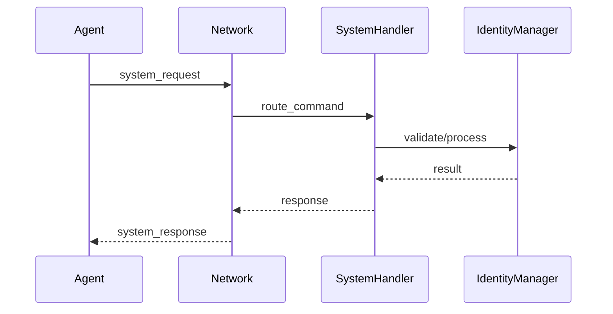

# System Commands

**Status:** ✅ Available  
**Version:** 1.0.0  
**Category:** Core Infrastructure

## Overview

The System Commands feature provides a standardized mod for agent-network communication in OpenAgents. It enables agents to perform system-level operations like registration, discovery, identity management, and health monitoring through a well-defined command interface.

## Architecture

### Command Flow



### Command Types

#### System Requests
Commands sent from agents to the network server:
- **Purpose**: Request network services or information
- **Format**: JSON with `type: "system_request"`
- **Processing**: Handled by server-side command handlers
- **Response**: Always generates a system response

#### System Responses
Replies sent from the network server to agents:
- **Purpose**: Provide results or acknowledgments
- **Format**: JSON with `type: "system_response"`
- **Processing**: Handled by client-side response handlers
- **Correlation**: Matches request command type

## Available Commands

### Core Commands

#### `register_agent`

Register an agent with the network and establish connection.

**Request:**
```json
{
    "type": "system_request",
    "command": "register_agent",
    "agent_id": "my-agent",
    "metadata": {
        "name": "My Agent",
        "capabilities": ["messaging", "file_transfer"],
        "version": "1.0.0"
    },
    "certificate": {
        "agent_id": "my-agent",
        "issued_at": 1640995200.0,
        "expires_at": 1641081600.0,
        "certificate_hash": "abc123...",
        "signature": "def456..."
    },
    "force_reconnect": false
}
```

**Response (Success):**
```json
{
    "type": "system_response",
    "command": "register_agent",
    "success": true,
    "network_name": "Production Network",
    "network_id": "network-12345",
    "metadata": {
        "server_version": "1.0.0",
        "supported_mods": ["simple_messaging"]
    }
}
```

**Response (Failure):**
```json
{
    "type": "system_response",
    "command": "register_agent",
    "success": false,
    "error": "Agent with this ID is already connected. Use force_reconnect=true or provide valid certificate to override."
}
```

**Enhanced Features:**
- **Certificate Validation**: Supports certificate-based identity verification
- **Conflict Resolution**: Handles duplicate agent ID conflicts
- **Force Override**: Allows legitimate agents to reclaim their IDs
- **Metadata Exchange**: Shares capabilities and configuration

#### `list_agents`

Retrieve list of connected agents in the network.

**Request:**
```json
{
    "type": "system_request", 
    "command": "list_agents",
    "agent_id": "requesting-agent",
    "filters": {
        "capabilities": ["messaging"],
        "status": "active"
    }
}
```

**Response:**
```json
{
    "type": "system_response",
    "command": "list_agents", 
    "success": true,
    "agents": [
        {
            "agent_id": "agent-001",
            "name": "File Processor",
            "capabilities": ["file_transfer", "data_processing"],
            "status": "active",
            "last_seen": 1640995200.0
        },
        {
            "agent_id": "agent-002", 
            "name": "Message Router",
            "capabilities": ["messaging", "routing"],
            "status": "active",
            "last_seen": 1640995180.0
        }
    ],
    "total_count": 2
}
```

#### `list_mods`

Get available mod adapters and their capabilities.

**Request:**
```json
{
    "type": "system_request",
    "command": "list_mods",
    "agent_id": "requesting-agent"
}
```

**Response:**
```json
{
    "type": "system_response",
    "command": "list_mods",
    "success": true,
    "mods": [
        {
            "name": "SimpleMessagingNetworkMod",
            "version": "1.0.0",
            "capabilities": ["direct_message", "broadcast_message"],
            "description": "Basic messaging mod for agent communication"
        }
    ]
}
```

### Identity Management Commands

#### `claim_agent_id`

Claim an agent ID and receive a cryptographic certificate.

**Request:**
```json
{
    "type": "system_request",
    "command": "claim_agent_id", 
    "agent_id": "my-secure-agent",
    "force": false
}
```

**Response (Success):**
```json
{
    "type": "system_response",
    "command": "claim_agent_id",
    "success": true,
    "agent_id": "my-secure-agent",
    "certificate": {
        "agent_id": "my-secure-agent",
        "issued_at": 1640995200.0,
        "expires_at": 1641081600.0,
        "certificate_hash": "sha256_hash_here",
        "signature": "hmac_signature_here"
    }
}
```

**Response (Failure):**
```json
{
    "type": "system_response",
    "command": "claim_agent_id",
    "success": false,
    "error": "Agent ID my-secure-agent is already claimed"
}
```

#### `validate_certificate`

Validate an agent identity certificate.

**Request:**
```json
{
    "type": "system_request",
    "command": "validate_certificate",
    "certificate": {
        "agent_id": "my-secure-agent",
        "issued_at": 1640995200.0,
        "expires_at": 1641081600.0,
        "certificate_hash": "sha256_hash_here",
        "signature": "hmac_signature_here"
    }
}
```

**Response:**
```json
{
    "type": "system_response",
    "command": "validate_certificate",
    "success": true,
    "valid": true,
    "agent_id": "my-secure-agent"
}
```

### Health Monitoring Commands

#### `ping_agent`

Health check ping to verify agent responsiveness.

**Request (Server → Agent):**
```json
{
    "type": "system_request",
    "command": "ping_agent",
    "timestamp": 1640995200.0
}
```

**Response (Agent → Server):**
```json
{
    "type": "system_response", 
    "command": "ping_agent",
    "success": true,
    "timestamp": 1640995200.0
}
```

**Features:**
- **Automatic Response**: Clients automatically respond to ping requests
- **Timeout Detection**: Server detects non-responsive agents
- **Activity Tracking**: Updates agent activity timestamps
- **Cleanup Trigger**: Failed pings trigger connection cleanup

### Mod Discovery Commands

#### `get_mod_manifest`

Retrieve detailed manifest for a specific mod.

**Request:**
```json
{
    "type": "system_request",
    "command": "get_mod_manifest",
    "agent_id": "requesting-agent",
    "mod_name": "SimpleMessagingNetworkMod"
}
```

**Response:**
```json
{
    "type": "system_response",
    "command": "get_mod_manifest",
    "success": true,
    "mod_name": "SimpleMessagingNetworkMod",
    "manifest": {
        "name": "SimpleMessagingNetworkMod",
        "version": "1.0.0",
        "description": "Basic messaging mod",
        "message_types": ["direct_message", "broadcast_message"],
        "capabilities": ["file_transfer", "encryption"],
        "configuration": {
            "max_message_size": 10485760,
            "supported_formats": ["text", "json", "binary"]
        }
    }
}
```

## Implementation

### Server-Side Handlers

#### Handler Registration
```python
from openagents.core.system_commands import (
    handle_register_agent, handle_list_agents, handle_list_mods,
    handle_ping_agent, handle_claim_agent_id, handle_validate_certificate,
    REGISTER_AGENT, LIST_AGENTS, LIST_PROTOCOLS, PING_AGENT,
    CLAIM_AGENT_ID, VALIDATE_CERTIFICATE
)

# In AgentNetwork._handle_system_message()
command = message.get("command")

if command == REGISTER_AGENT:
    await handle_register_agent(command, message, connection, self)
elif command == LIST_AGENTS:
    await handle_list_agents(command, message, connection, self)
elif command == LIST_PROTOCOLS:
    await handle_list_mods(command, message, connection, self)
elif command == PING_AGENT:
    await handle_ping_agent(command, message, connection, self)
elif command == CLAIM_AGENT_ID:
    await handle_claim_agent_id(command, message, connection, self)
elif command == VALIDATE_CERTIFICATE:
    await handle_validate_certificate(command, message, connection, self)
```

#### Custom Handler Example
```python
async def handle_custom_command(command: str, data: Dict[str, Any], 
                               connection: ServerConnection,
                               network_instance: Any) -> None:
    """Custom system command handler"""
    
    # Extract parameters
    requesting_agent = data.get("agent_id")
    custom_param = data.get("custom_parameter")
    
    try:
        # Validate request
        if not requesting_agent:
            await send_error_response(connection, command, "Missing agent_id")
            return
        
        # Process command
        result = await process_custom_logic(custom_param)
        
        # Send success response
        await connection.send(json.dumps({
            "type": "system_response",
            "command": command,
            "success": True,
            "result": result
        }))
        
    except Exception as e:
        logger.error(f"Error in custom command handler: {e}")
        await send_error_response(connection, command, str(e))

async def send_error_response(connection: ServerConnection, command: str, error: str):
    """Send standardized error response"""
    await connection.send(json.dumps({
        "type": "system_response",
        "command": command,
        "success": False,
        "error": error
    }))
```

### Client-Side Implementation

#### Request Methods
```python
# In NetworkConnector class
async def send_system_request(self, command: str, **kwargs) -> bool:
    """Send system request to server"""
    try:
        # Build request
        request_data = {
            "type": "system_request",
            "command": command,
            "agent_id": self.agent_id,  # Auto-include agent ID
            **kwargs
        }
        
        # Send request
        await self.connection.send(json.dumps(request_data))
        logger.debug(f"Sent system request: {command}")
        return True
        
    except Exception as e:
        logger.error(f"Failed to send system request {command}: {e}")
        return False

# Convenience methods
async def list_agents(self) -> bool:
    return await self.send_system_request("list_agents")

async def list_mods(self) -> bool:
    return await self.send_system_request("list_mods")

async def claim_agent_id(self, agent_id: str, force: bool = False) -> bool:
    return await self.send_system_request("claim_agent_id", agent_id=agent_id, force=force)
```

#### Response Handling
```python
# In NetworkConnector._listen_for_messages()
elif data.get("type") == "system_response":
    command = data.get("command")
    if command in self.system_handlers:
        await self.system_handlers[command](data)
    else:
        logger.debug(f"Received system response for command {command}")

# Register response handlers
self.connector.register_system_handler("list_agents", handle_agent_list_response)
self.connector.register_system_handler("claim_agent_id", handle_claim_response)

async def handle_agent_list_response(data: Dict[str, Any]):
    """Handle agent list response"""
    if data.get("success"):
        agents = data.get("agents", [])
        print(f"Connected agents: {len(agents)}")
        for agent in agents:
            print(f"  - {agent['agent_id']}: {agent['name']}")
    else:
        print(f"Error listing agents: {data.get('error')}")
```

## Usage Examples

### Basic Agent Registration

```python
import asyncio
from openagents.core.client import AgentClient

async def register_agent_example():
    """Basic agent registration example"""
    
    client = AgentClient(agent_id="example-agent")
    
    try:
        # Connect with metadata
        metadata = {
            "name": "Example Agent",
            "capabilities": ["messaging", "file_transfer"],
            "version": "1.0.0",
            "description": "Demonstration agent"
        }
        
        success = await client.connect_to_server(
            host="localhost", 
            port=8080,
            metadata=metadata
        )
        
        if success:
            print("✅ Agent registered successfully")
            
            # Agent is now connected and can send/receive messages
            await asyncio.sleep(10)
            
        else:
            print("❌ Agent registration failed")
    
    finally:
        await client.disconnect()

asyncio.run(register_agent_example())
```

### Secure Agent with Identity Management

```python
async def secure_agent_example():
    """Agent with certificate-based identity"""
    
    client = AgentClient(agent_id="secure-agent")
    
    # Step 1: Claim agent ID and get certificate
    await client.connect_to_server("localhost", 8080)
    
    certificate = None
    
    async def handle_claim_response(data):
        nonlocal certificate
        if data.get("success"):
            certificate = data.get("certificate")
            print("✅ Received identity certificate")
    
    client.connector.register_system_handler("claim_agent_id", handle_claim_response)
    await client.connector.claim_agent_id("secure-agent")
    await asyncio.sleep(2)  # Wait for response
    await client.disconnect()
    
    # Step 2: Reconnect with certificate
    if certificate:
        metadata = {
            "name": "Secure Agent",
            "certificate": certificate
        }
        
        success = await client.connect_to_server(
            "localhost", 8080, 
            metadata=metadata
        )
        
        if success:
            print("✅ Secure reconnection successful")
        else:
            print("❌ Certificate validation failed")
    
    await client.disconnect()
```

### Network Discovery and Monitoring

```python
class NetworkMonitor:
    def __init__(self, agent_id: str):
        self.client = AgentClient(agent_id=agent_id)
        self.agents = []
        self.mods = []
    
    async def connect_and_discover(self):
        """Connect and discover network resources"""
        
        # Connect to network
        if not await self.client.connect_to_server("localhost", 8080):
            print("Failed to connect to network")
            return
        
        # Set up response handlers
        self.client.connector.register_system_handler(
            "list_agents", self._handle_agent_list
        )
        self.client.connector.register_system_handler(
            "list_mods", self._handle_mod_list
        )
        
        # Discover agents and mods
        await self.client.connector.list_agents()
        await self.client.connector.list_mods()
        
        # Wait for responses
        await asyncio.sleep(3)
        
        # Display discovered resources
        self._display_discovery_results()
    
    async def _handle_agent_list(self, data: Dict[str, Any]):
        """Handle agent list response"""
        if data.get("success"):
            self.agents = data.get("agents", [])
    
    async def _handle_mod_list(self, data: Dict[str, Any]):
        """Handle mod list response"""
        if data.get("success"):
            self.mods = data.get("mods", [])
    
    def _display_discovery_results(self):
        """Display discovery results"""
        print(f"\n📊 Network Discovery Results")
        print(f"=" * 40)
        
        print(f"\n🤖 Connected Agents ({len(self.agents)}):")
        for agent in self.agents:
            capabilities = ", ".join(agent.get("capabilities", []))
            print(f"  • {agent['agent_id']}: {agent.get('name', 'Unknown')}")
            print(f"    Capabilities: {capabilities}")
        
        print(f"\n🔌 Available Mods ({len(self.mods)}):")
        for mod in self.mods:
            print(f"  • {mod['name']} v{mod['version']}")
            print(f"    Description: {mod.get('description', 'No description')}")
    
    async def monitor_network(self, interval: int = 30):
        """Continuously monitor network changes"""
        try:
            while True:
                # Refresh agent list
                await self.client.connector.list_agents()
                await asyncio.sleep(2)  # Wait for response
                
                # Display current state
                print(f"\n🔄 Network Status Update ({len(self.agents)} agents)")
                
                await asyncio.sleep(interval)
                
        except KeyboardInterrupt:
            print("\n⏹️  Monitoring stopped")
        finally:
            await self.client.disconnect()

# Usage
async def network_monitoring_example():
    monitor = NetworkMonitor("network-monitor")
    await monitor.connect_and_discover()
    await monitor.monitor_network()

asyncio.run(network_monitoring_example())
```

### Custom System Command

```python
# Server-side: Add custom command handler
CUSTOM_HEALTH_CHECK = "custom_health_check"

async def handle_custom_health_check(command: str, data: Dict[str, Any],
                                   connection: ServerConnection,
                                   network_instance: Any) -> None:
    """Custom health check command"""
    
    requesting_agent = data.get("agent_id")
    check_type = data.get("check_type", "basic")
    
    # Perform health checks
    health_data = {
        "network_uptime": time.time() - network_instance.start_time,
        "connected_agents": len(network_instance.connections),
        "memory_usage": get_memory_usage(),
        "check_timestamp": time.time()
    }
    
    if check_type == "detailed":
        health_data.update({
            "agent_details": [
                {
                    "agent_id": aid,
                    "last_activity": conn.last_activity,
                    "inactive_time": time.time() - conn.last_activity
                }
                for aid, conn in network_instance.connections.items()
            ]
        })
    
    # Send response
    await connection.send(json.dumps({
        "type": "system_response",
        "command": "custom_health_check",
        "success": True,
        "health_data": health_data
    }))

# Register the custom handler
# In network._handle_system_message():
elif command == CUSTOM_HEALTH_CHECK:
    await handle_custom_health_check(command, message, connection, self)

# Client-side: Use custom command
async def custom_health_check_example():
    client = AgentClient(agent_id="health-monitor")
    await client.connect_to_server("localhost", 8080)
    
    # Set up response handler
    async def handle_health_response(data):
        if data.get("success"):
            health = data.get("health_data", {})
            print(f"📊 Network Health:")
            print(f"  Uptime: {health.get('network_uptime', 0):.1f}s")
            print(f"  Agents: {health.get('connected_agents', 0)}")
            print(f"  Memory: {health.get('memory_usage', 0):.1f}MB")
    
    client.connector.register_system_handler("custom_health_check", handle_health_response)
    
    # Send custom health check request
    await client.connector.send_system_request(
        "custom_health_check", 
        check_type="detailed"
    )
    
    await asyncio.sleep(2)
    await client.disconnect()
```

## Error Handling

### Standardized Error Responses

```python
# Standard error response format
{
    "type": "system_response",
    "command": "command_name",
    "success": false,
    "error": "Human-readable error message",
    "error_code": "ERROR_CODE",  # Optional
    "details": {                 # Optional
        "additional": "context"
    }
}
```

### Error Categories

#### Validation Errors
- **Missing Parameters**: Required fields not provided
- **Invalid Format**: Malformed request data
- **Type Mismatch**: Incorrect data types

#### Authorization Errors
- **Unauthorized**: Agent not authorized for operation
- **Invalid Certificate**: Certificate validation failed
- **Expired Certificate**: Certificate has expired

#### Resource Errors
- **Not Found**: Requested resource doesn't exist
- **Already Exists**: Resource already exists (e.g., agent ID)
- **Limit Exceeded**: Resource limits reached

#### System Errors
- **Internal Error**: Unexpected server error
- **Service Unavailable**: Service temporarily unavailable
- **Timeout**: Operation timed out

### Error Handling Best Practices

```python
class RobustSystemClient:
    def __init__(self, agent_id: str):
        self.client = AgentClient(agent_id=agent_id)
        self.retry_config = {
            "max_retries": 3,
            "retry_delay": 1.0,
            "backoff_multiplier": 2.0
        }
    
    async def robust_system_request(self, command: str, **kwargs) -> Dict[str, Any]:
        """System request with retry logic and error handling"""
        
        last_error = None
        
        for attempt in range(self.retry_config["max_retries"]):
            try:
                # Set up response capture
                response_data = {}
                response_received = asyncio.Event()
                
                async def capture_response(data):
                    response_data.update(data)
                    response_received.set()
                
                # Register temporary handler
                self.client.connector.register_system_handler(command, capture_response)
                
                # Send request
                success = await self.client.connector.send_system_request(command, **kwargs)
                
                if not success:
                    raise Exception("Failed to send system request")
                
                # Wait for response with timeout
                try:
                    await asyncio.wait_for(response_received.wait(), timeout=10.0)
                except asyncio.TimeoutError:
                    raise Exception("System request timeout")
                
                # Check response
                if response_data.get("success"):
                    return response_data
                else:
                    error = response_data.get("error", "Unknown error")
                    error_code = response_data.get("error_code")
                    
                    # Check if error is retryable
                    if not self._is_retryable_error(error_code):
                        raise Exception(f"Non-retryable error: {error}")
                    
                    last_error = Exception(f"Request failed: {error}")
                
            except Exception as e:
                last_error = e
                logger.warning(f"System request attempt {attempt + 1} failed: {e}")
                
                if attempt < self.retry_config["max_retries"] - 1:
                    delay = self.retry_config["retry_delay"] * (
                        self.retry_config["backoff_multiplier"] ** attempt
                    )
                    await asyncio.sleep(delay)
        
        # All retries failed
        raise last_error or Exception("All retry attempts failed")
    
    def _is_retryable_error(self, error_code: str) -> bool:
        """Check if error code indicates a retryable error"""
        retryable_codes = {
            "TIMEOUT",
            "SERVICE_UNAVAILABLE", 
            "INTERNAL_ERROR",
            "NETWORK_ERROR"
        }
        return error_code in retryable_codes
```

## Performance Considerations

### Request Batching

```python
class BatchedSystemClient:
    def __init__(self, client: AgentClient):
        self.client = client
        self.batch_queue = []
        self.batch_size = 10
        self.batch_timeout = 1.0
        self.batch_task = None
    
    async def batch_request(self, command: str, **kwargs) -> asyncio.Future:
        """Add request to batch and return future for result"""
        
        # Create future for result
        result_future = asyncio.Future()
        
        # Add to batch queue
        self.batch_queue.append({
            "command": command,
            "kwargs": kwargs,
            "future": result_future
        })
        
        # Start batch processor if needed
        if self.batch_task is None or self.batch_task.done():
            self.batch_task = asyncio.create_task(self._process_batch())
        
        return result_future
    
    async def _process_batch(self):
        """Process requests in batches"""
        while self.batch_queue:
            # Wait for batch to fill or timeout
            start_time = time.time()
            while (len(self.batch_queue) < self.batch_size and 
                   time.time() - start_time < self.batch_timeout):
                await asyncio.sleep(0.01)
            
            # Process current batch
            batch = self.batch_queue[:self.batch_size]
            self.batch_queue = self.batch_queue[self.batch_size:]
            
            await self._execute_batch(batch)
    
    async def _execute_batch(self, batch):
        """Execute batch of requests"""
        
        # Group by command type for optimization
        command_groups = {}
        for item in batch:
            command = item["command"]
            if command not in command_groups:
                command_groups[command] = []
            command_groups[command].append(item)
        
        # Execute each command group
        for command, items in command_groups.items():
            if command == "list_agents":
                # Optimize: single list_agents call for multiple requests
                await self._execute_list_agents_batch(items)
            else:
                # Execute individually for other commands
                for item in items:
                    await self._execute_single_request(item)
```

### Caching

```python
class CachedSystemClient:
    def __init__(self, client: AgentClient):
        self.client = client
        self.cache = {}
        self.cache_ttl = {
            "list_agents": 30,      # 30 seconds
            "list_mods": 300,  # 5 minutes
        }
    
    async def cached_request(self, command: str, **kwargs) -> Dict[str, Any]:
        """System request with response caching"""
        
        # Generate cache key
        cache_key = self._generate_cache_key(command, kwargs)
        
        # Check cache
        if cache_key in self.cache:
            cache_entry = self.cache[cache_key]
            if time.time() - cache_entry["timestamp"] < self.cache_ttl.get(command, 0):
                logger.debug(f"Cache hit for {command}")
                return cache_entry["data"]
            else:
                # Remove expired entry
                del self.cache[cache_key]
        
        # Execute request
        result = await self._execute_request(command, **kwargs)
        
        # Cache result if cacheable
        if command in self.cache_ttl and result.get("success"):
            self.cache[cache_key] = {
                "data": result,
                "timestamp": time.time()
            }
            logger.debug(f"Cached result for {command}")
        
        return result
    
    def _generate_cache_key(self, command: str, kwargs: Dict[str, Any]) -> str:
        """Generate cache key for request"""
        import hashlib
        import json
        
        key_data = {"command": command, "kwargs": kwargs}
        key_string = json.dumps(key_data, sort_keys=True)
        return hashlib.md5(key_string.encode()).hexdigest()
```

## Testing and Debugging

### Command Testing Framework

```python
class SystemCommandTester:
    def __init__(self, network_host: str = "localhost", network_port: int = 8080):
        self.host = network_host
        self.port = network_port
        self.test_results = []
    
    async def test_command(self, command: str, expected_success: bool = True, **kwargs):
        """Test a system command"""
        
        test_start = time.time()
        client = AgentClient(agent_id=f"test-{uuid.uuid4().hex[:8]}")
        
        try:
            # Connect
            if not await client.connect_to_server(self.host, self.port):
                raise Exception("Failed to connect to network")
            
            # Set up response capture
            response_data = {}
            response_received = asyncio.Event()
            
            async def capture_response(data):
                response_data.update(data)
                response_received.set()
            
            client.connector.register_system_handler(command, capture_response)
            
            # Send command
            success = await client.connector.send_system_request(command, **kwargs)
            if not success:
                raise Exception("Failed to send request")
            
            # Wait for response
            await asyncio.wait_for(response_received.wait(), timeout=10.0)
            
            # Validate response
            actual_success = response_data.get("success", False)
            
            test_result = {
                "command": command,
                "expected_success": expected_success,
                "actual_success": actual_success,
                "response_data": response_data,
                "duration": time.time() - test_start,
                "passed": actual_success == expected_success
            }
            
            self.test_results.append(test_result)
            
            if test_result["passed"]:
                print(f"✅ {command}: PASS ({test_result['duration']:.3f}s)")
            else:
                print(f"❌ {command}: FAIL ({test_result['duration']:.3f}s)")
                print(f"   Expected: {expected_success}, Got: {actual_success}")
                if not actual_success:
                    print(f"   Error: {response_data.get('error')}")
            
            return test_result
            
        except Exception as e:
            test_result = {
                "command": command,
                "expected_success": expected_success,
                "actual_success": False,
                "error": str(e),
                "duration": time.time() - test_start,
                "passed": not expected_success
            }
            
            self.test_results.append(test_result)
            print(f"❌ {command}: ERROR ({test_result['duration']:.3f}s) - {e}")
            return test_result
            
        finally:
            await client.disconnect()
    
    async def run_all_tests(self):
        """Run comprehensive test suite"""
        print("🧪 Running System Command Tests")
        print("=" * 40)
        
        # Test basic commands
        await self.test_command("list_agents")
        await self.test_command("list_mods")
        
        # Test identity management
        test_agent_id = f"test-agent-{uuid.uuid4().hex[:8]}"
        await self.test_command("claim_agent_id", agent_id=test_agent_id)
        await self.test_command("claim_agent_id", expected_success=False, agent_id=test_agent_id)  # Should fail
        
        # Test with invalid parameters
        await self.test_command("claim_agent_id", expected_success=False)  # Missing agent_id
        
        # Display results
        self.print_test_summary()
    
    def print_test_summary(self):
        """Print test results summary"""
        total_tests = len(self.test_results)
        passed_tests = sum(1 for result in self.test_results if result["passed"])
        
        print("\n" + "=" * 40)
        print(f"Test Summary: {passed_tests}/{total_tests} passed")
        print("=" * 40)
        
        if passed_tests == total_tests:
            print("🎉 All tests passed!")
        else:
            print("❌ Some tests failed:")
            for result in self.test_results:
                if not result["passed"]:
                    print(f"  • {result['command']}: {result.get('error', 'Unexpected result')}")

# Usage
async def run_system_command_tests():
    tester = SystemCommandTester()
    await tester.run_all_tests()

asyncio.run(run_system_command_tests())
```

This comprehensive System Commands documentation covers the complete command mod, implementation details, usage examples, and testing framework for OpenAgents' system-level communication infrastructure.